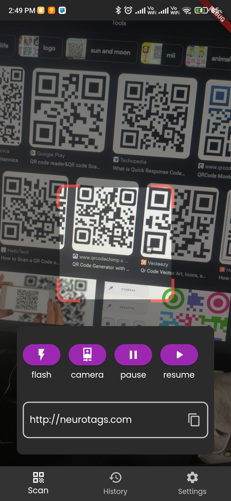
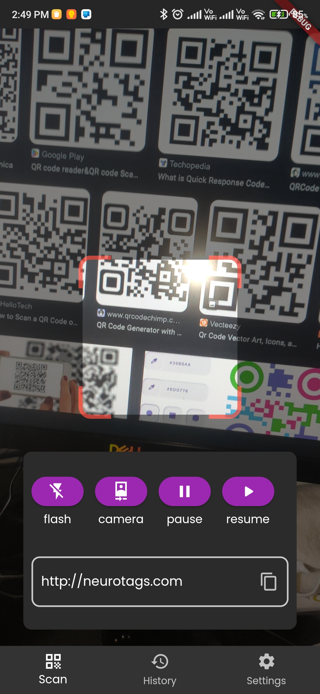
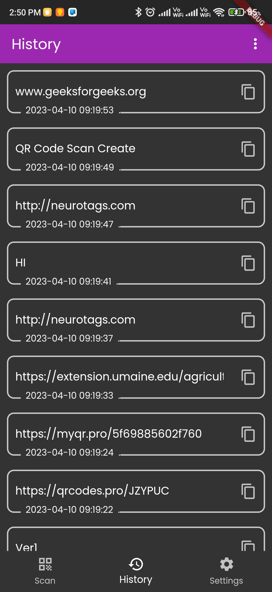

# QR Code Scanner

A QR scanner app made using flutter,i have used [qr library](https://pub.dev/packages/qr_code_scanner) . i have used SQFlite library to store qr codes and show them in history tab

## Features

- scan any QR code
- History tab to show previous scans
- options for flash,front camera and play, pause etc
- friendly UI

## Screenshots

